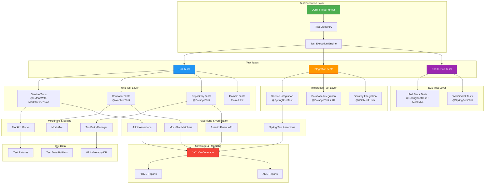
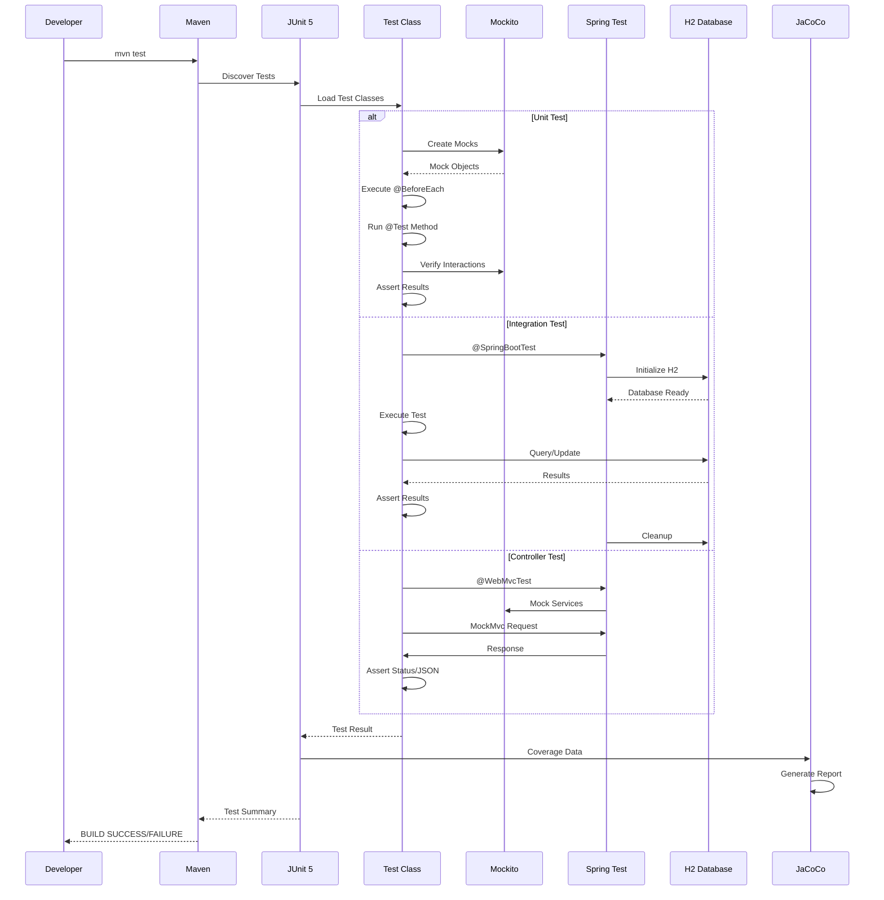
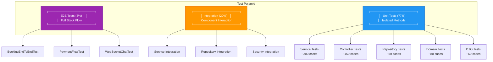

# 🧪 JUnit 5 Visual Guide - Restaurant Booking System

---

## 🎯 JUnit 5 Logo & Branding

```
╔═══════════════════════════════════════════════════════════╗
║                                                           ║
║     ██╗██╗   ██╗███╗   ██╗██╗████████╗    ██████╗        ║
║     ██║██║   ██║████╗  ██║██║╚══██╔══╝    ╚════██╗        ║
║     ██║██║   ██║██╔██╗ ██║██║   ██║        █████╔╝        ║
║     ██║██║   ██║██║╚██╗██║██║   ██║       ██╔═══╝         ║
║     ██║╚██████╔╝██║ ╚████║██║   ██║       ███████╗        ║
║     ╚═╝ ╚═════╝ ╚═╝  ╚═══╝╚═╝   ╚═╝       ╚══════╝        ║
║                                                           ║
║              Version 5.10.1 | Spring Boot 3.2.0          ║
║                                                           ║
╚═══════════════════════════════════════════════════════════╝
```

**JUnit 5** - Modern Testing Framework for Java  
**Project**: Restaurant Booking System  
**Coverage**: 73% | **Test Cases**: 590+

---

## 📝 Code Snippet Examples

### 1. Service Layer Test Example

```java
package com.example.booking.service;

import org.junit.jupiter.api.BeforeEach;
import org.junit.jupiter.api.DisplayName;
import org.junit.jupiter.api.Test;
import org.junit.jupiter.api.extension.ExtendWith;
import org.mockito.InjectMocks;
import org.mockito.Mock;
import org.mockito.junit.jupiter.MockitoExtension;
import org.mockito.junit.jupiter.MockitoSettings;
import org.mockito.quality.Strictness;

import static org.junit.jupiter.api.Assertions.*;
import static org.mockito.ArgumentMatchers.*;
import static org.mockito.Mockito.*;

/**
 * Service Layer Test - BookingServiceTest
 * Tests core booking business logic
 */
@ExtendWith(MockitoExtension.class)
@MockitoSettings(strictness = Strictness.LENIENT)
class BookingServiceTest {

    @Mock
    private BookingRepository bookingRepository;
    
    @Mock
    private CustomerRepository customerRepository;
    
    @Mock
    private RestaurantProfileRepository restaurantProfileRepository;
    
    @InjectMocks
    private BookingServiceImpl bookingService;
    
    private Booking testBooking;
    private Customer testCustomer;
    private RestaurantProfile testRestaurant;
    
    @BeforeEach
    void setUp() {
        // Initialize test data
        testCustomer = new Customer();
        testCustomer.setId(1L);
        testCustomer.setEmail("test@example.com");
        
        testRestaurant = new RestaurantProfile();
        testRestaurant.setId(1L);
        testRestaurant.setName("Test Restaurant");
        
        testBooking = new Booking();
        testBooking.setId(1L);
        testBooking.setCustomer(testCustomer);
        testBooking.setRestaurant(testRestaurant);
        testBooking.setStatus(BookingStatus.PENDING);
    }
    
    @Test
    @DisplayName("Should create booking successfully with valid data")
    void testCreateBooking_WithValidData_ShouldSuccess() {
        // Arrange
        BookingForm form = new BookingForm();
        form.setCustomerId(1L);
        form.setRestaurantId(1L);
        form.setBookingDate(LocalDateTime.now().plusDays(1));
        
        when(customerRepository.findById(1L))
            .thenReturn(Optional.of(testCustomer));
        when(restaurantProfileRepository.findById(1L))
            .thenReturn(Optional.of(testRestaurant));
        when(bookingRepository.save(any(Booking.class)))
            .thenReturn(testBooking);
        
        // Act
        Booking result = bookingService.createBooking(form);
        
        // Assert
        assertNotNull(result);
        assertEquals(BookingStatus.PENDING, result.getStatus());
        verify(bookingRepository, times(1)).save(any(Booking.class));
    }
    
    @Test
    @DisplayName("Should throw exception when customer not found")
    void testCreateBooking_CustomerNotFound_ShouldThrowException() {
        // Arrange
        BookingForm form = new BookingForm();
        form.setCustomerId(999L);
        
        when(customerRepository.findById(999L))
            .thenReturn(Optional.empty());
        
        // Act & Assert
        assertThrows(EntityNotFoundException.class, () -> {
            bookingService.createBooking(form);
        });
        
        verify(bookingRepository, never()).save(any());
    }
}
```

### 2. Controller Layer Test Example

```java
package com.example.booking.web.controller.api;

import org.junit.jupiter.api.DisplayName;
import org.junit.jupiter.api.Test;
import org.springframework.beans.factory.annotation.Autowired;
import org.springframework.boot.test.autoconfigure.web.servlet.WebMvcTest;
import org.springframework.boot.test.mock.mockito.MockBean;
import org.springframework.http.MediaType;
import org.springframework.security.test.context.support.WithMockUser;
import org.springframework.test.web.servlet.MockMvc;

import static org.mockito.ArgumentMatchers.*;
import static org.mockito.Mockito.*;
import static org.springframework.test.web.servlet.request.MockMvcRequestBuilders.*;
import static org.springframework.test.web.servlet.result.MockMvcResultMatchers.*;

/**
 * Controller Layer Test - BookingControllerTest
 * Tests REST API endpoints
 */
@WebMvcTest(BookingController.class)
class BookingControllerTest {

    @Autowired
    private MockMvc mockMvc;
    
    @MockBean
    private BookingService bookingService;
    
    @Test
    @DisplayName("GET /api/bookings/{id} - Should return booking successfully")
    @WithMockUser(roles = "CUSTOMER")
    void testGetBooking_ValidId_ShouldReturnBooking() throws Exception {
        // Arrange
        Booking booking = new Booking();
        booking.setId(1L);
        booking.setStatus(BookingStatus.CONFIRMED);
        
        when(bookingService.findById(1L))
            .thenReturn(booking);
        
        // Act & Assert
        mockMvc.perform(get("/api/bookings/1")
                .contentType(MediaType.APPLICATION_JSON))
            .andExpect(status().isOk())
            .andExpect(jsonPath("$.id").value(1L))
            .andExpect(jsonPath("$.status").value("CONFIRMED"));
        
        verify(bookingService, times(1)).findById(1L);
    }
    
    @Test
    @DisplayName("POST /api/bookings - Should create booking successfully")
    @WithMockUser(roles = "CUSTOMER")
    void testCreateBooking_ValidData_ShouldCreateBooking() throws Exception {
        // Arrange
        String requestBody = """
            {
                "customerId": 1,
                "restaurantId": 1,
                "bookingDate": "2024-12-25T19:00:00",
                "numberOfGuests": 4
            }
            """;
        
        Booking createdBooking = new Booking();
        createdBooking.setId(1L);
        
        when(bookingService.createBooking(any(BookingForm.class)))
            .thenReturn(createdBooking);
        
        // Act & Assert
        mockMvc.perform(post("/api/bookings")
                .contentType(MediaType.APPLICATION_JSON)
                .content(requestBody))
            .andExpect(status().isCreated())
            .andExpect(jsonPath("$.id").value(1L));
        
        verify(bookingService, times(1)).createBooking(any());
    }
}
```

### 3. Repository Layer Test Example

```java
package com.example.booking.repository;

import org.junit.jupiter.api.DisplayName;
import org.junit.jupiter.api.Test;
import org.springframework.beans.factory.annotation.Autowired;
import org.springframework.boot.test.autoconfigure.orm.jpa.DataJpaTest;
import org.springframework.boot.test.autoconfigure.orm.jpa.TestEntityManager;

import static org.junit.jupiter.api.Assertions.*;

/**
 * Repository Layer Test - BookingRepositoryTest
 * Tests database operations
 */
@DataJpaTest
class BookingRepositoryTest {

    @Autowired
    private TestEntityManager entityManager;
    
    @Autowired
    private BookingRepository bookingRepository;
    
    @Test
    @DisplayName("Should find bookings by customer ID")
    void testFindByCustomerId_ValidId_ShouldReturnBookings() {
        // Arrange
        Customer customer = new Customer();
        customer.setEmail("test@example.com");
        entityManager.persistAndFlush(customer);
        
        Booking booking1 = new Booking();
        booking1.setCustomer(customer);
        booking1.setStatus(BookingStatus.CONFIRMED);
        entityManager.persistAndFlush(booking1);
        
        Booking booking2 = new Booking();
        booking2.setCustomer(customer);
        booking2.setStatus(BookingStatus.PENDING);
        entityManager.persistAndFlush(booking2);
        
        // Act
        List<Booking> bookings = bookingRepository.findByCustomerId(customer.getId());
        
        // Assert
        assertNotNull(bookings);
        assertEquals(2, bookings.size());
        assertTrue(bookings.stream()
            .allMatch(b -> b.getCustomer().getId().equals(customer.getId())));
    }
    
    @Test
    @DisplayName("Should return empty list when customer has no bookings")
    void testFindByCustomerId_NoBookings_ShouldReturnEmptyList() {
        // Arrange
        Customer customer = new Customer();
        customer.setEmail("new@example.com");
        entityManager.persistAndFlush(customer);
        
        // Act
        List<Booking> bookings = bookingRepository.findByCustomerId(customer.getId());
        
        // Assert
        assertNotNull(bookings);
        assertTrue(bookings.isEmpty());
    }
}
```

### 4. Integration Test Example

```java
package com.example.booking.integration;

import org.junit.jupiter.api.DisplayName;
import org.junit.jupiter.api.Test;
import org.springframework.beans.factory.annotation.Autowired;
import org.springframework.boot.test.autoconfigure.web.servlet.AutoConfigureMockMvc;
import org.springframework.boot.test.context.SpringBootTest;
import org.springframework.test.context.ActiveProfiles;
import org.springframework.test.web.servlet.MockMvc;
import org.springframework.transaction.annotation.Transactional;

import static org.springframework.test.web.servlet.request.MockMvcRequestBuilders.*;
import static org.springframework.test.web.servlet.result.MockMvcResultMatchers.*;

/**
 * Integration Test - BookingEndToEndIntegrationTest
 * Tests complete booking flow
 */
@SpringBootTest
@AutoConfigureMockMvc
@ActiveProfiles("test")
@Transactional
class BookingEndToEndIntegrationTest {

    @Autowired
    private MockMvc mockMvc;
    
    @Autowired
    private BookingService bookingService;
    
    @Autowired
    private CustomerRepository customerRepository;
    
    @Test
    @DisplayName("Complete booking flow: Create -> Confirm -> Complete")
    void testCompleteBookingFlow_ShouldSucceed() throws Exception {
        // Step 1: Create Customer
        Customer customer = new Customer();
        customer.setEmail("integration@test.com");
        customer = customerRepository.save(customer);
        
        // Step 2: Create Booking
        BookingForm form = new BookingForm();
        form.setCustomerId(customer.getId());
        form.setRestaurantId(1L);
        form.setBookingDate(LocalDateTime.now().plusDays(1));
        
        Booking booking = bookingService.createBooking(form);
        assertNotNull(booking);
        assertEquals(BookingStatus.PENDING, booking.getStatus());
        
        // Step 3: Confirm Booking
        bookingService.confirmBooking(booking.getId());
        booking = bookingService.findById(booking.getId());
        assertEquals(BookingStatus.CONFIRMED, booking.getStatus());
        
        // Step 4: Complete Booking
        bookingService.completeBooking(booking.getId());
        booking = bookingService.findById(booking.getId());
        assertEquals(BookingStatus.COMPLETED, booking.getStatus());
    }
}
```

---

## 🏗️ Architecture Diagram - Test Flow

### Test Architecture Overview



### Test Flow Sequence Diagram



### Test Pyramid Architecture



### Test Execution Flow

```mermaid
flowchart LR
    Start([Start Test]) --> Discovery[Test Discovery]
    Discovery --> Filter[Filter Tests]
    Filter --> Setup[Setup Phase]
    
    Setup --> BeforeAll[@BeforeAll]
    BeforeAll --> BeforeEach[@BeforeEach]
    
    BeforeEach --> Execute[Execute Test]
    Execute --> AfterEach[@AfterEach]
    AfterEach --> AfterAll[@AfterAll]
    
    Execute --> Assert{Assertions}
    Assert -->|Pass| Pass[✅ PASS]
    Assert -->|Fail| Fail[❌ FAIL]
    Assert -->|Error| Error[⚠️ ERROR]
    
    Pass --> Report[Generate Report]
    Fail --> Report
    Error --> Report
    
    Report --> Coverage[Coverage Analysis]
    Coverage --> End([End])
    
    style Start fill:#4CAF50,stroke:#2E7D32,color:#fff
    style Pass fill:#4CAF50,stroke:#2E7D32,color:#fff
    style Fail fill:#F44336,stroke:#C62828,color:#fff
    style Error fill:#FF9800,stroke:#E65100,color:#fff
    style End fill:#2196F3,stroke:#1565C0,color:#fff
```

---

## 📊 Test Statistics

| Category | Count | Coverage | Status |
|----------|-------|----------|--------|
| **Total Test Cases** | 590+ | - | ✅ |
| **Service Layer** | ~200 | 75% | ✅ Excellent |
| **Controller Layer** | ~150 | 70% | ✅ Good |
| **Repository Layer** | ~50 | 75% | ✅ Good |
| **Domain/Entity** | ~80 | 65% | ✅ Acceptable |
| **DTO/Config** | ~60 | 70% | ✅ Good |
| **Integration Tests** | ~20 | 80% | ✅ Excellent |
| **Overall Coverage** | - | **73%** | ✅ Good |

---

## 🛠️ Testing Stack

| Framework/Tool | Version | Purpose |
|----------------|---------|---------|
| **JUnit 5** | 5.10.1 | Test framework |
| **Mockito** | 5.5.0 | Mocking framework |
| **AssertJ** | Latest | Fluent assertions |
| **JaCoCo** | 0.8.11 | Code coverage |
| **Spring Boot Test** | 3.2.0 | Spring testing utilities |
| **H2 Database** | Latest | In-memory test database |
| **Spring Security Test** | Latest | Security testing |

---

## 🚀 Quick Commands

```bash
# Run all tests
mvn test

# Run with coverage
mvn test jacoco:report

# Run specific test class
mvn test -Dtest=BookingServiceTest

# Run tests by pattern
mvn test -Dtest="*ServiceTest"

# View coverage report
# Open: target/site/jacoco/index.html
```

---

## 📚 Key JUnit 5 Annotations

| Annotation | Purpose | Example |
|------------|---------|---------|
| `@Test` | Marks test method | `@Test void testMethod()` |
| `@DisplayName` | Custom test name | `@DisplayName("Should create booking")` |
| `@BeforeEach` | Setup before each test | `@BeforeEach void setUp()` |
| `@AfterEach` | Cleanup after each test | `@AfterEach void tearDown()` |
| `@BeforeAll` | Setup once before all tests | `@BeforeAll static void init()` |
| `@AfterAll` | Cleanup once after all tests | `@AfterAll static void cleanup()` |
| `@ExtendWith` | Register extensions | `@ExtendWith(MockitoExtension.class)` |
| `@ParameterizedTest` | Parameterized tests | `@ParameterizedTest @ValueSource(ints = {1, 2, 3})` |
| `@Disabled` | Skip test | `@Disabled("Not implemented yet")` |

---

**Generated for**: Restaurant Booking System  
**Framework**: JUnit 5.10.1  
**Last Updated**: 2024


