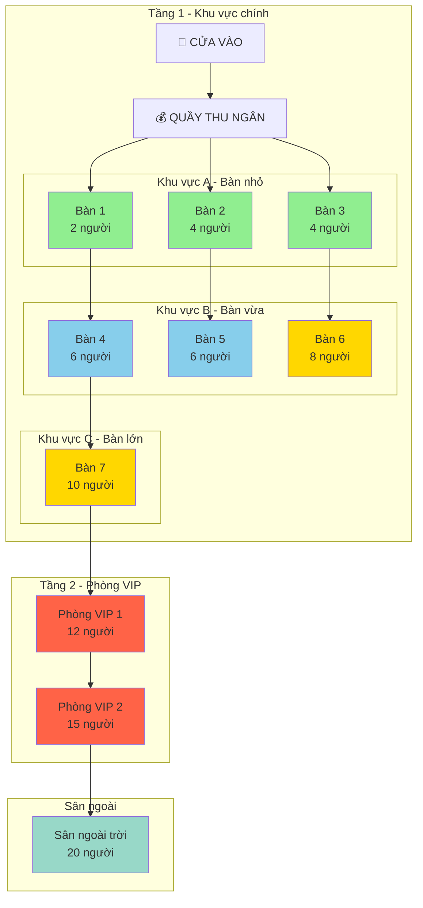
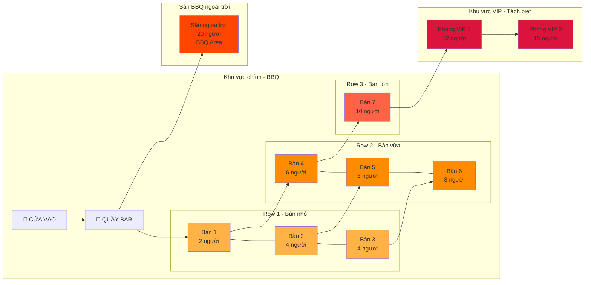
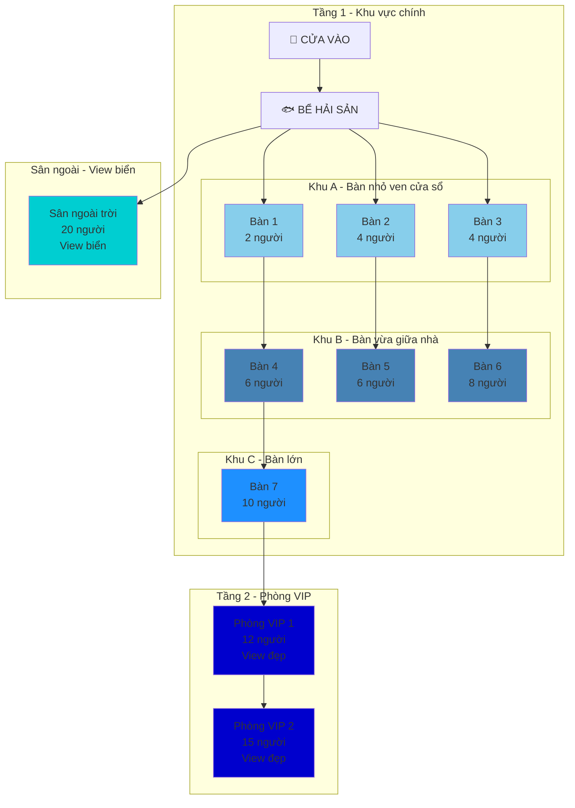
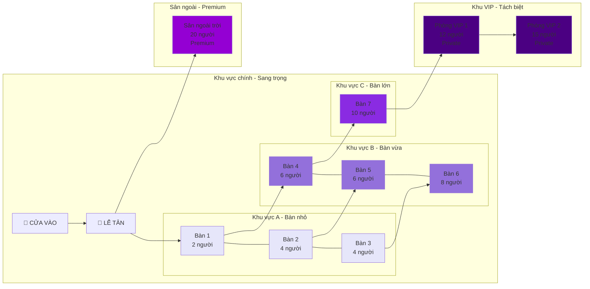
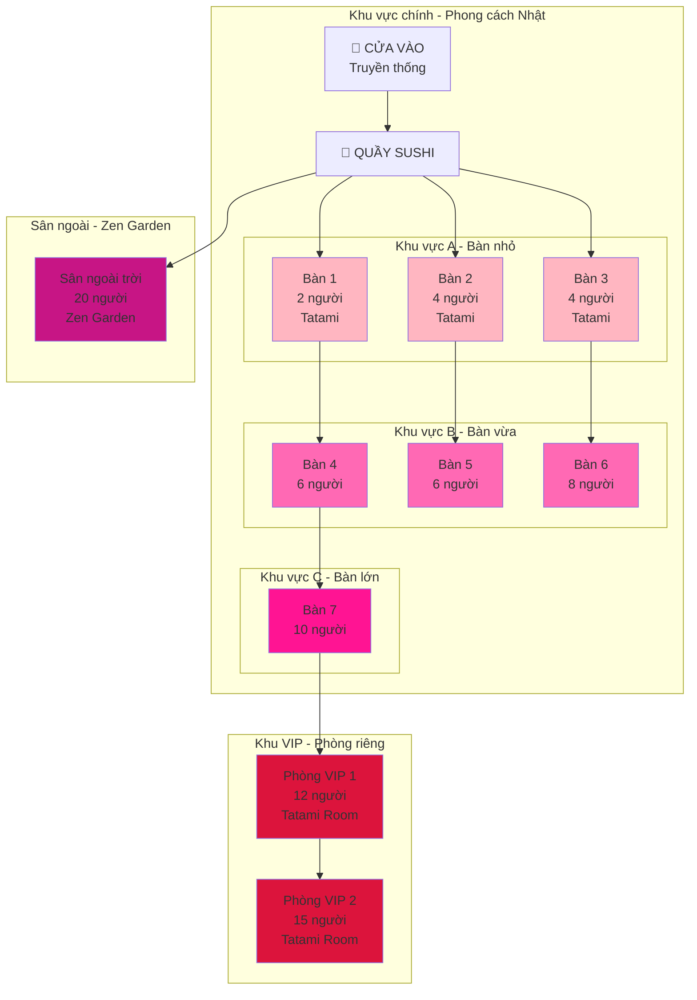
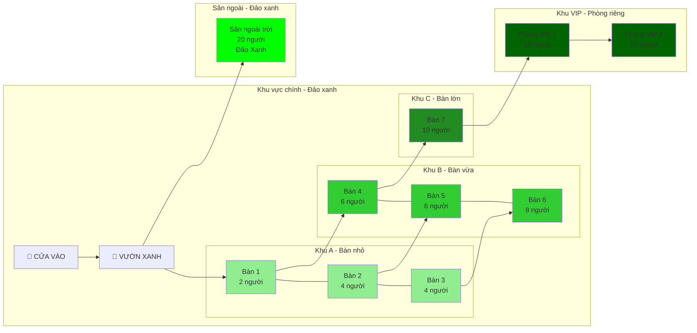
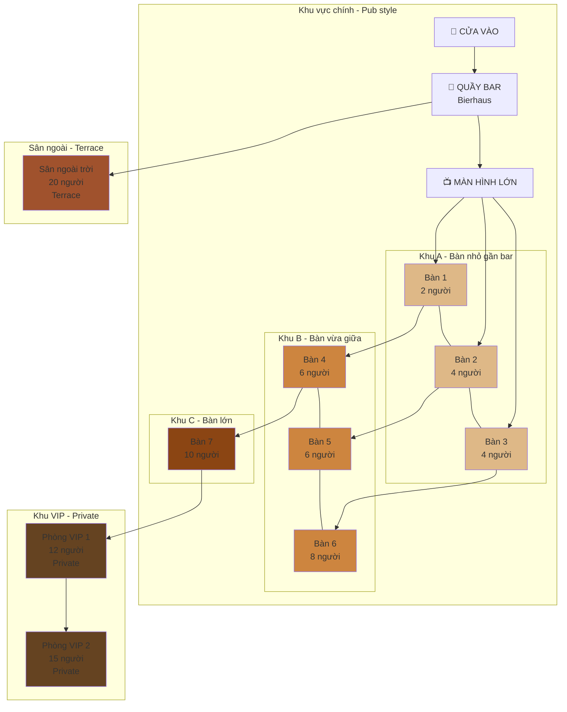
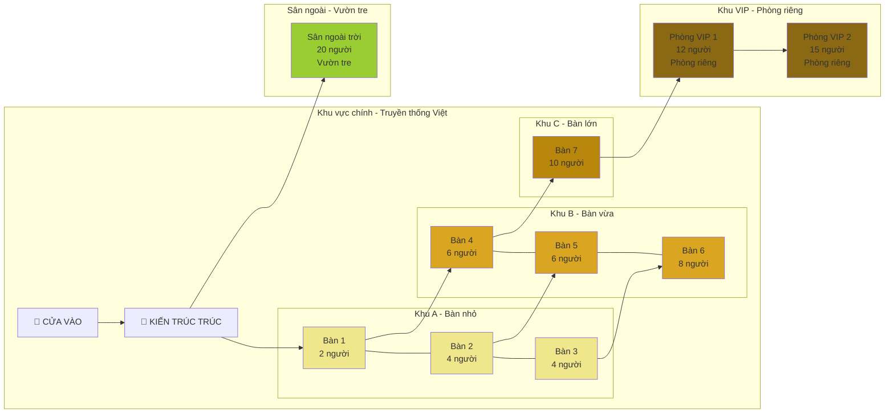
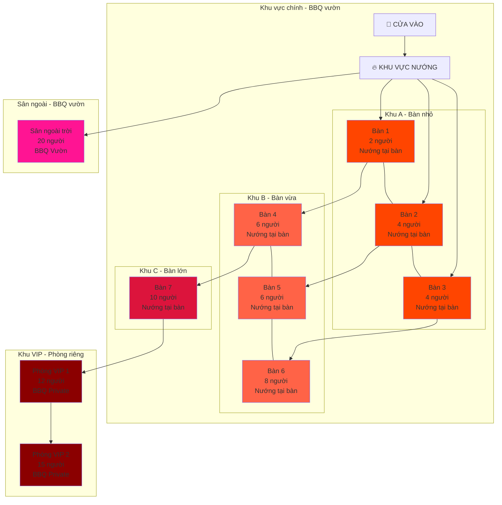
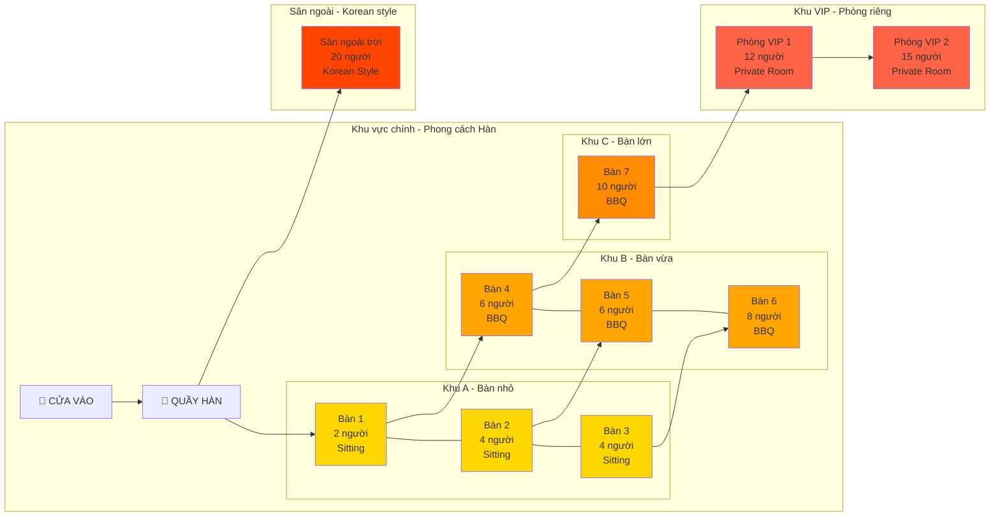

# 🪑 SƠ ĐỒ BỐ TRÍ BÀN CHO 10 NHÀ HÀNG

## 📋 Cấu hình bàn (mỗi nhà hàng có 10 bàn):
- Bàn 1: 2 người
- Bàn 2: 4 người
- Bàn 3: 4 người
- Bàn 4: 6 người
- Bàn 5: 6 người
- Bàn 6: 8 người
- Bàn 7: 10 người
- Phòng VIP 1: 12 người
- Phòng VIP 2: 15 người
- Sân ngoài trời: 20 người

---

## 1️⃣ Cơm niêu 3 Cá Bống – Nguyễn Tri Phương

---

## 2️⃣ Country BBQ & Beer - Trần Bạch Đằng

---

## 3️⃣ Hải Sản Bà Cường – Hoàng Sa

---

## 4️⃣ Hải Sản Ngọc Hương – Võ Nguyên Giáp

---

## 5️⃣ Nhà hàng Akataiyo Mặt Trời Đỏ - Nguyễn Du

---

## 6️⃣ Phố Biển – Đảo Xanh

---

## 7️⃣ The Anchor (Restaurant & Bierhaus) - Trần Phú

---

## 8️⃣ Vietbamboo Restaurant - Phạm Văn Đồng

---

## 9️⃣ Vườn Nướng - Đường 304

---

## 🔟 Zzuggubbong - Nguyễn Hữu Thông

---

## 📊 BẢNG TỔNG HỢP

| Nhà hàng | Tổng sức chứa | Khu vực chính | Khu VIP | Sân ngoài |
|----------|---------------|---------------|---------|-----------|
| 1. Cơm niêu 3 Cá Bống | 93 người | 7 bàn (40 người) | 2 phòng (27 người) | 1 sân (20 người) |
| 2. Country BBQ & Beer | 93 người | 7 bàn (40 người) | 2 phòng (27 người) | 1 sân (20 người) |
| 3. Hải Sản Bà Cường | 93 người | 7 bàn (40 người) | 2 phòng (27 người) | 1 sân (20 người) |
| 4. Hải Sản Ngọc Hương | 93 người | 7 bàn (40 người) | 2 phòng (27 người) | 1 sân (20 người) |
| 5. Akataiyo | 93 người | 7 bàn (40 người) | 2 phòng (27 người) | 1 sân (20 người) |
| 6. Phố Biển | 93 người | 7 bàn (40 người) | 2 phòng (27 người) | 1 sân (20 người) |
| 7. The Anchor | 93 người | 7 bàn (40 người) | 2 phòng (27 người) | 1 sân (20 người) |
| 8. Vietbamboo | 93 người | 7 bàn (40 người) | 2 phòng (27 người) | 1 sân (20 người) |
| 9. Vườn Nướng | 93 người | 7 bàn (40 người) | 2 phòng (27 người) | 1 sân (20 người) |
| 10. Zzuggubbong | 93 người | 7 bàn (40 người) | 2 phòng (27 người) | 1 sân (20 người) |

**Tổng sức chứa tối đa mỗi nhà hàng: 93 người**

---

## 🎨 CHÚ GIẢI MÀU SẮC

- 🟢 **Xanh lá nhạt**: Bàn nhỏ (2-4 người)
- 🔵 **Xanh dương**: Bàn vừa (6 người)
- 🟡 **Vàng**: Bàn lớn (8-10 người)
- 🔴 **Đỏ**: Phòng VIP (12-15 người)
- 🟢 **Xanh lá đậm/Xanh ngọc**: Sân ngoài trời (20 người)

---

## 📝 LƯU Ý

- Tất cả sơ đồ được thiết kế để tối ưu không gian và luồng khách
- Khu VIP được đặt ở vị trí tách biệt, riêng tư
- Sân ngoài trời thường gần khu vực chính để dễ phục vụ
- Bố trí bàn theo nguyên tắc: nhỏ gần cửa, lớn ở trong, VIP tách biệt

